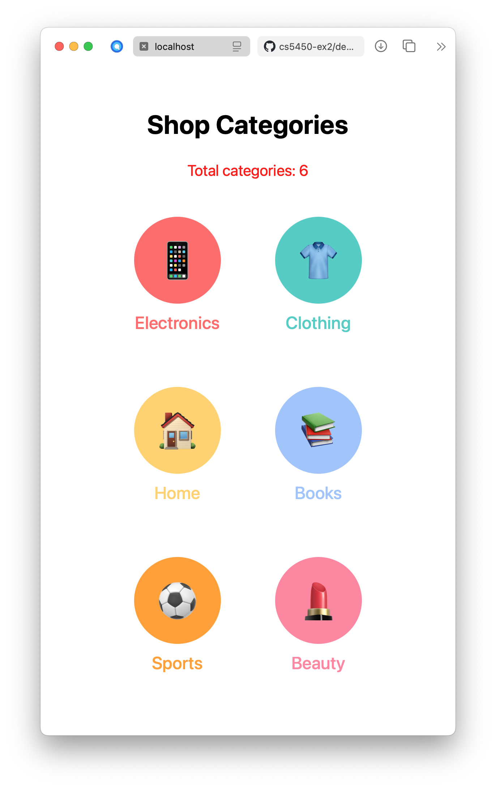

# cs5450-ex2

A simple shopping app built with React Native. Users can browse products by categories and check product inventory.




### 1. Browse Categories
- View all shopping categories on the main screen
- Each category has an icon and color

### 2. View Products
- See all products in a category
- Each product shows:
  - Name
  - Price
  - Description
  - Stock status (red, yellow, or green dot)

### 3. Product Details
- Tap a product to see more information
- Check detailed inventory status
- Stock is shown with colors:
  - Green: Many items (>10)
  - Yellow: Few items (6-10)
  - Red: Very few items (≤5)

## How It Works

### Data Structure
- Categories have: id, name, emoji, color, and products list
- Products have: id, name, price, description, and stock count

### Implementation
- Built using React Native and TypeScript
- Uses React's useState to manage:
  - Selected category
  - Selected product
  - Button press effects
- Three screen views:
  1. Categories grid
  2. Products list
  3. Product detail
- Navigation between screens using back buttons
- Color indicators to show stock levels

## How to Run

1. Install dependencies:
```
npm install
```

2. Start the app:
```
npm start
```